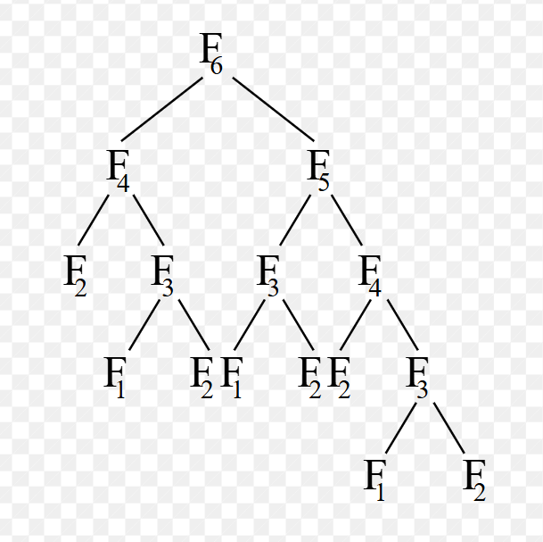
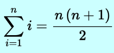

# Part A:
## What is the Complexity Analysis of the `hello_recursive` function? 🤔
* The **complexity** is O($2^n$)

## **Justification:**
* The function `hello_recursive` will make a recursive call for the `hello_recursive` function 2 times per call, making a Binary tree shape with a height $n$.
* This makes a number of $2^n$ calls, as at each level the number of nodes is **doubled**, so the **complexity** is O($2^n$).

---
Then let's move to the second part -> 🏃‍♂️‍➡️

---

## What is the Complexity Analysis of the `test` function? 🔎🧐 
* The `test` function complexity is: **$O(\log^2 n)$** or $[\log^2(n) + \log(n)]/2$ in detail.

## **Justification:**
Let's trace **( والمية تكدب الغطاس )**:
* Since $i$ is equal to $n$, in the first iteration the inner loop will make $\log(n)$ moves.
* In the second iteration $i /= 2$, so it will cause $\log(n/2)$ iterations in the inner loop, then $\log(n/4)$, then $\log(n/8)$, and so on.
* Even if it seems like a geometric series at first, when we focus more we remember that: $\log(a/b) = \log(a) - \log(b)$.
* So to be more accurate, it is: $(\log(n) + (\log(n) - \log(2)) + (\log(n) - \log(4)) + (\log(n) - \log(8)) \dots)$
* Since the base of the log is 2, it can be written as: $(\log(n) + (\log(n) - 1) + (\log(n) - 2) + (\log(n) - 3) \dots + (\log(n) - \log(n)))$

**So it is absolutely an Arithmetic Series!**

Therefore, the complexity is:

 $\frac{\log(n) \cdot (\log(n) + 1)}{2} \approx \log^2(n)$.

---
# Part A:
## What is the Complexity Analysis of the `hello_recursive` function? 🤔
* The **complexity** is O($2^n$)

## **Justification:**
* The function `hello_recursive` will make a recursive call for the `hello_recursive` function 2 times per call, making a Binary tree shape with a height $n$.
* This makes a number of $2^n$ calls, as at each level the number of nodes is **doubled**, so the **complexity** is O($2^n$).